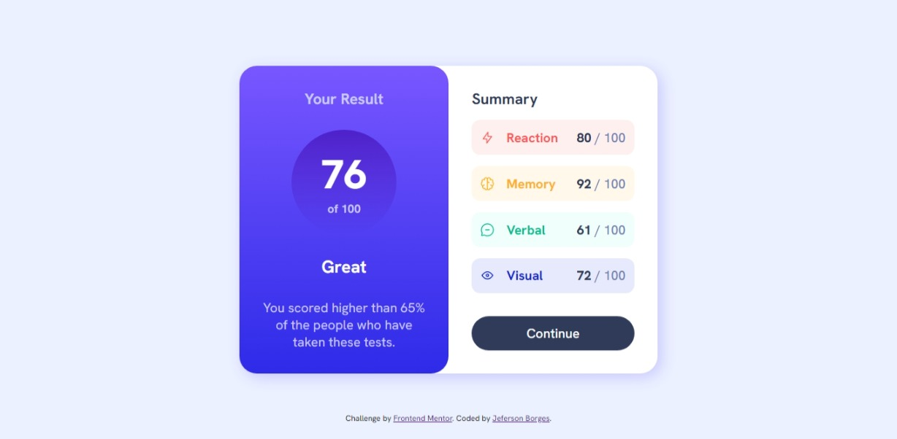
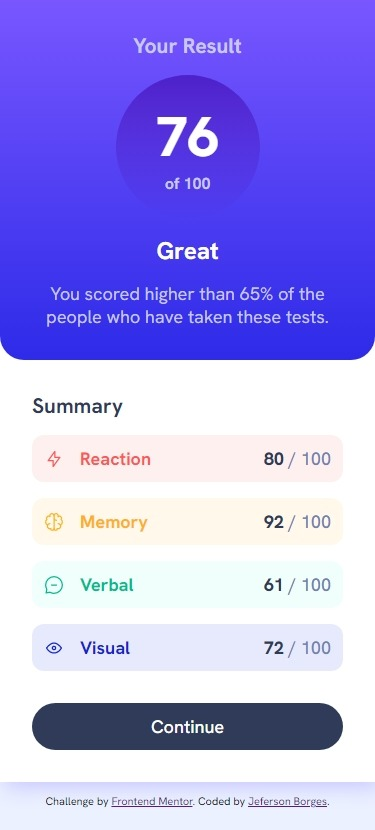

# Frontend Mentor - Results summary component solution

This is a solution to the [Results summary component challenge on Frontend Mentor](https://www.frontendmentor.io/challenges/results-summary-component-CE_K6s0maV).

Any comments on the code are welcome! This time the challenge was to improve the acessibility and responsivity of the page. I Used JavaScript DOM to generate the HTML content in the attributes summary section and to calculate the overall result. What do you guys think of that?

## Table of contents

- [Overview](#overview)
  - [The challenge](#the-challenge)
  - [Screenshot](#screenshot)
  - [Links](#links)
- [My process](#my-process)
  - [Built with](#built-with)
  - [What I learned](#what-i-learned)
  - [Continued development](#continued-development)
  - [Useful resources](#useful-resources)
- [Author](#author)

## Overview

### The challenge

Users should be able to:

- View the optimal layout for the interface depending on their device's screen size
- See hover and focus states for all interactive elements on the page

### Screenshot

#### Desktop

#### Mobile

### Links

- Solution URL: [Github repository](https://github.com/jefersonBorges/fem-results_summary_component)
- Live Site URL: [Github live page](https://jefersonborges.github.io/fem-results_summary_component/)

## My process

### Built with

- Semantic HTML5 markup
- SASS
- Flexbox
- Javascript DOM

### What I learned

- Using css grid and flexbox together
- Using variable local fonts

### Continued development

Here are some coding aspects I would like to improve

- CSS best practices
- Responsive pages
- Font embedding

### Useful resources

- [26 Rules I Follow When Writing CSS To Make It Concise and Readable](https://arbaouimehdi.medium.com/26-rules-i-follow-when-writing-css-to-make-it-concise-and-readable-b56547a345b4) - This article is helping me better organize my CSS coding.

- [Semantic HTML: the foundation of web accessibility](https://uxdesign.cc/semantic-html-the-foundation-of-web-accessibility-e5bbecad7c17) - This article is helping me to better understand the structure of a semantic HTML page and how this affects accessibility.

- [px, em or rem Media Queries?](https://zellwk.com/blog/media-query-units/) - This article is helping me to better use css units.

## Author

- GitHub - [jefersonBorges](https://github.com/jefersonBorges/jefersonBorges)
- Frontend Mentor - [@jefersonBorges](https://www.frontendmentor.io/profile/jefersonBorges)
- Linkedin - [Jeferson Borges Linkedin](https://www.linkedin.com/in/jeferson-borges-543b34229)
